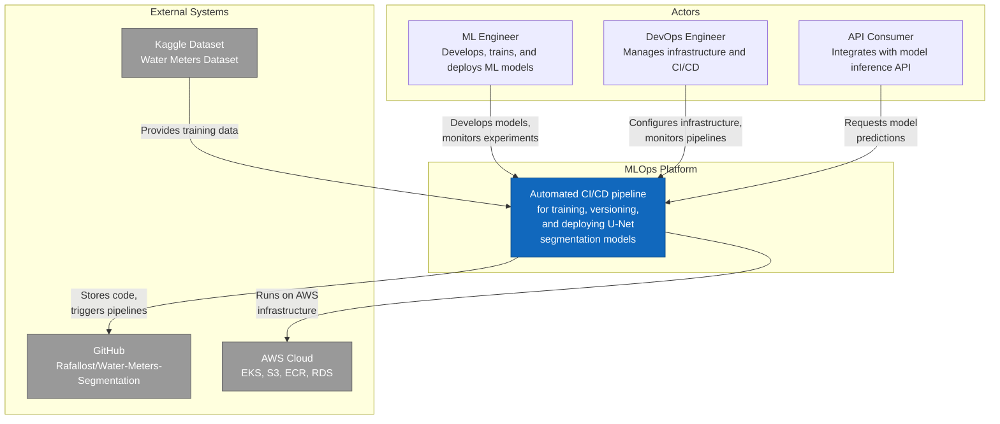
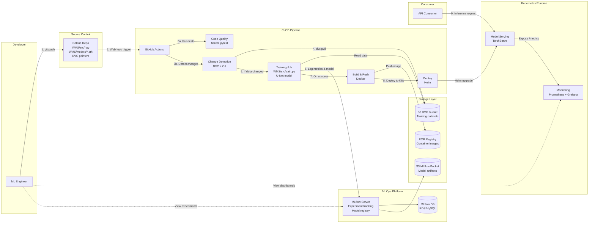
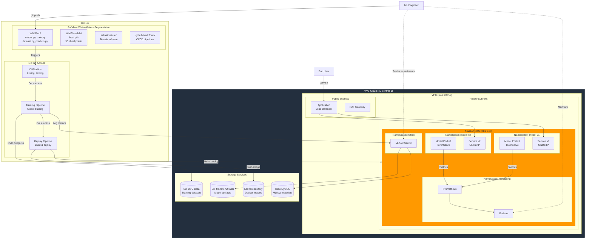
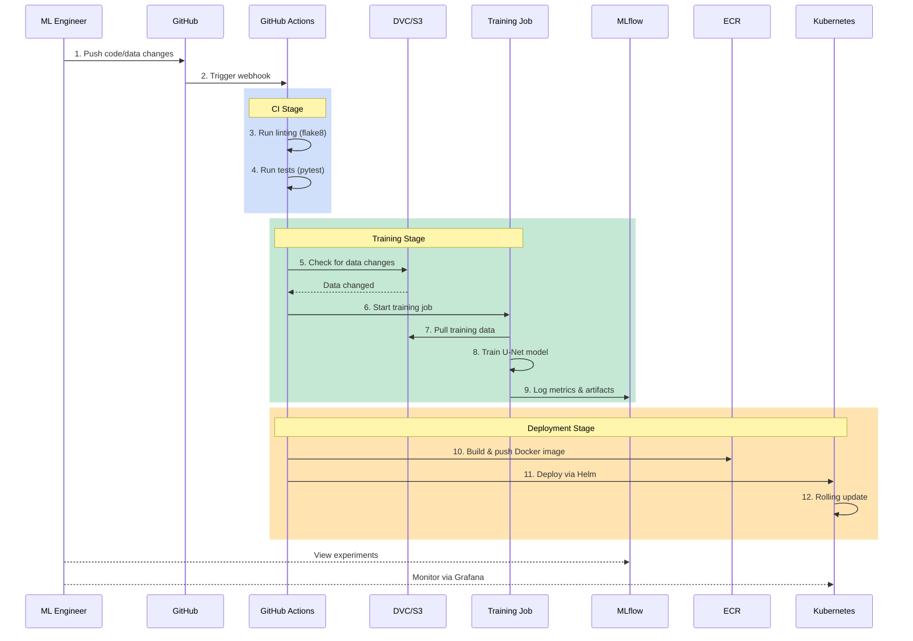
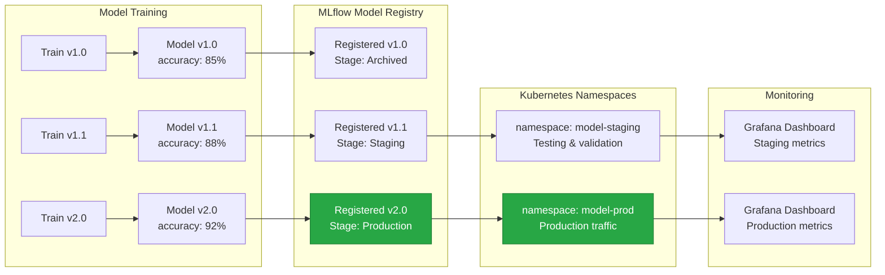

# MLOps System Diagrams

## 1. C4 Context Diagram - System Overview

---

## 2. Data Flow Diagram - Training and Deployment Pipeline

---

## 3. Deployment Diagram - AWS Infrastructure

---

## 4. CI/CD Pipeline Sequence

---

## 5. Model Versioning Flow

